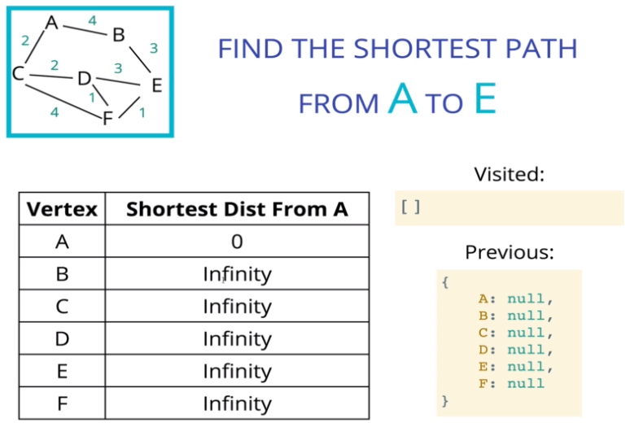
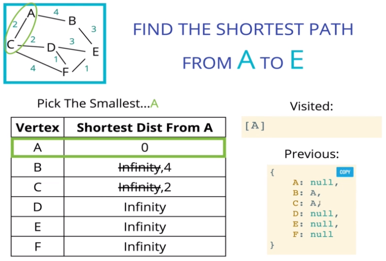
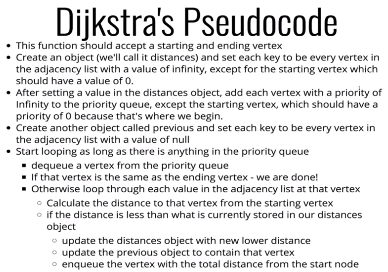

# Dijkstra's Algorithm

다익스트라 최단 경로 알고리즘(Dijkstra's Shortest Path Algorithm)은 그래프의 한 정점에서 다른 정점으로 갈 수 있는 **최단 경로를 찾는 알고리즘**이다.

다익스트라 알고리즘은 거의 대부분의 IT 기업에서 사용되고 있으며, 네트워크에서 라우팅 테이블을 작성하는데 사용되기도 한다.

<br>

## 가중치 그래프 (Weighted Graph)

다익스트라의 최단 경로 알고리즘은 최단 경로를 찾기 위해 **가중치 그래프를 사용**한다.

가중치 그래프는 **간선이 가중치를 포함**하는 것을 제외하면 기존의 그래프 구현 방식과 다르지 않으며, 다음은 연결 리스트의 형태로 표현된 가중치 그래프의 예시이다.

```javascript
AdjacencyList {
    "A": [{ node: "B", weight: 10 }, { node: "C", weight: 15 }],
    "B": [{ node: "A", weight: 10 }],
    "C": [{ node: "A", weight: 15 }], 
}
```

<br>

## 알고리즘 동작 방식

다익스트라의 최소 경로 알고리즘은 다음과 같은 순서로 동작한다.

0. 시작 정점에서 다른 정점으로의 최소 비용을 저장하기 위한 자료구조를 초기화한다.
    - 시작 정점에서 시작 정점으로의 최소 비용은 0이다.
    - 초기화 시점에서, 다른 노드로의 비용은 `Infinity`이다.

      
1. 매번 새로운 정점을 방문할 때, 가장 작은 비용을 가진 정점을 선택한다.
2. 새롭게 방문한 정점의 모든 이웃 정점을 확인한다.
3. 각 이웃 정점에 대해, 해당 정점으로 이동하기 위한 비용을 계산한다.
    - 시작 정점에서 현재 정점까지의 비용과 현재 정점에서 이웃 정점으로의 비용을 더한다.
    - *Total Cost = Cost from Start to Current + Cost from Current to Neighbor*   
4. 새롭게 계산된 총 비용이 현재의 총 비용보다 작다면, 최소 비용을 갱신한다.
    - 최소 비용으로 현재 정점에 도착하기 직전에 방문한 정점을 기억해 놓는다.
      
5. 마지막 정점에서부터 기억해 놓은 직전 노드를 따라 올라가면 최단 경로를 얻을 수 있다.

다익스트라 알고리즘은 하나의 정점에서 특정 정점까지의 최단 경로만을 구하는 것이 아니라, 동작하는 과정에서 **하나의 정점에서 그래프의 다른 모든 정점까지의 최단 경로**를 구하게 된다.

따라서 간선의 비용이 변하지 않는 이상, 다익스트라 알고리즘을 다시 수행하지 않아도 된다.

<br>

## 우선 순위 큐

> 매번 새로운 정점을 방문할 때, 가장 작은 비용을 가진 정점을 선택한다.

다익스트라 알고리즘에서 가장 작은 비용의 정점을 선택할 때, 반복문을 사용해 최소 비용을 탐색하는 방법(= Naive)이 있다. 하지만, 반복문을 사용하는 방법은 정점의 개수가 증가하면 **시간 복잡도가 O(N)이므로 알고리즘 성능에 악영향**을 미치게 된다.

따라서 알고리즘의 성능을 개선하기 위해 O(logN)의 시간 복잡도를 가지는 **우선순위 큐를 사용**하기도 한다.

그러나 강의에서는 다익스트라 알고리즘에 집중하기 위해 아래와 같이 `Array.prototype.sort()` 메서드를 이용해 우선순위 큐를 표현하였다. 

```javascript
class FakePriorityQueue {
    constructor() {
        this.values = [];
    };
    enqueue(val, priority) {
        this.values.push({ val, priority });
        this.sort();
    };
    dequeue() {
        return this.values.shift();
    };
    sort() {
        this.values.sort((valueA, valueB) => valueA.priority - valueB.priority);
    };
}
```

<br>

## 의사 코드

