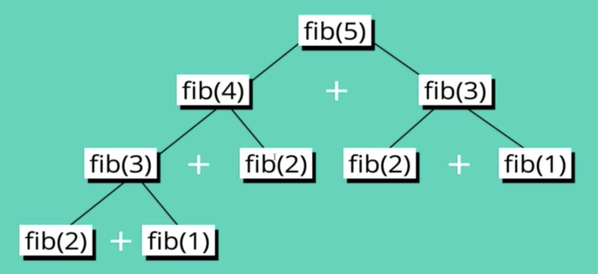
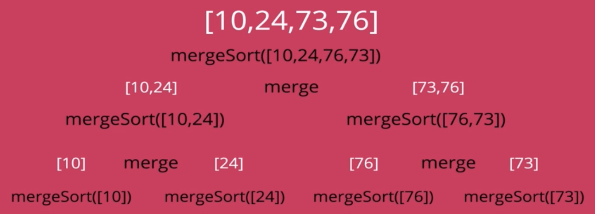
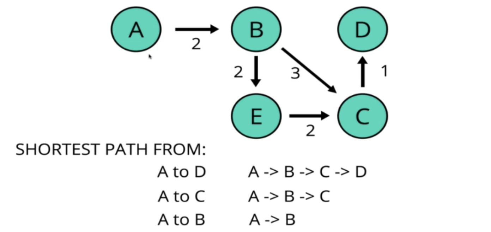

# Dynamic Programming

동적 계획법(Dynamic Programming)은 **복잡한 문제를 여러개의 단순한 부분 문제로 분리**하고, 이러한 **작은 문재를 단 한번만 풀이**한 결과를 저장하는 방식으로 동작한다. 

동적 계획법은 복잡한 문제를 해결하는데 소요되는 시간을 획기적으로 단축시킬 수 있는 알고리즘이지만, 다음의 *특정한 조건*을 만족하는 경우에만 사용할 수 있다.

- 중복되는 작은 문제(Overlapping Subproblem)
  - 하나의 복잡한 문제를 여래 개의 부분 문제로 분리할 수 있어야 한다.
    - 다만, 이러한 **부분 문제가 한 번 이상 반복**되어야 한다.
    - 부분 문제가 반복되지 않으면 **분할 정복(Divide and Conquer) 문제**가 된다.
  - 예를 들어, 피보나치 수열에서 `fibonacci(5)`의 결과를 구하는 문제를 작은 문제로 분리할 때,
    - **`fibonacci(3)`의 결과를 구하는 작은 문제를 두 번 수행**해야 한다.
    
  - 문제를 분리해도 부분 문제가 중복되지 않는 경우, 동적 계획법을 적용할 수 없다.
    - **합병 정렬(Merge Sort)의 경우, 각 부분 문제는 유일**하며 중복되지 않는다.
    

- 최적의 부분 구조(Optimal Substructure)를 가진다.
  - 한 문제에 대한 최적의 해결책이 **부분 문제에 대한 최적의 해결책을 기반**으로 해야한다.
    - 즉, 문제의 정답을 작은 부분 문제의 정답을 이용해 구할 수 있어야 한다.
  - 예를 들어, 서울에서 대구까지의 최단 경로가 3시간, 대구에서 부산까지의 최단 경로가 2시간일 때,
    - **서울 → 대구 → 부산의 최단 경로는 두 최단 경로를 합한 5시간**이 되어야 한다.
      
    - 최종적으로 도출된 최단 경로가 5시간이 아니면, **최적의 부분 구조를 가지지 않는 것**이다.
  - 작은 문제에 대한 최적의 해를 이용해 문제의 정답을 구할 수 없다면, 동적 계획법을 적용할 수 없다.
    - SFO에서 SEA를 경유해 FAI까지 가는 항공편의 최저가가 185달러 일 때,
      - SFO에서 SEA까지 가는 항공편의 최저가는 보장할 수 없다.
      - SFO → PDX → SEA로 이동하는 새로운 최저가 항공편이 존재할 수 있다.

<br>

## 재귀 함수를 사용한 풀이의 문제점

```javascript
// Time Complexity O(2^n) - Exponential
function fibonacci(number) { 
  if (number <= 2) return 1;
  return fibonacci(number - 1) + fibonacci(number - 2);
}
```
재귀 함수를 이용해 피보나치 수열을 계산하는 경우, `O(2^n)`의 시간 복잡도를 가지게 되어 알고리즘의 수행 시간이 숫자의 크기에 따라 지수적으로 증가하게 된다.

재귀 함수를 이용한 해결 방법의 가장 큰 문제점은, **중복되는 부분 문제(Overlapping Subproblem)에 대한 해답을 반복해서 계산한다**는 것이다.

즉, `fiboacci(5)`의 결과를 구하기 위해 이미 `fibonacci(3)`과 `fibonacci(4)`를 계산했지만 **부분 문제인 `fibonacci(4)`의 결과를 구하기 위해 `fibonacci(3)`을 다시 계산**한다.

이러한 비효율적인 측면을 **메모이제이션(Memoization)을 이용해 해결**할 수 있다.

<br>

## 메모이제이션(Memoization)

메모이제이션은 비용이 큰 함수의 호출 결과를 저장하고, 이후 **동일한 입력값으로 함수가 호출되는 경우 함수를 수행하는 대신 저장된 값(Cached Value)을 반환**하는 기법이다.  

예를 들어 피보나치 수열 문제에서, `fibonacci(3)`을 호출한 결과를 배열 등에 저장해 놓고 다시 한번 `fibonacci(3)`이 호출되면 이전에 저장한 결과를 반환하는 것이다.

```javascript
// Time Complexity O(n) - Linear
function fibonacci(num, memo = []) {
  // 이미 계산한 값이 존재하면, 그 값을 반환한다.
  if (memo[num]) return memo[num];  
  if (num <= 2) return 1;

  const result = fibonacci(num - 1, memo) + fibonacci(num - 2, memo);
  memo[num] = result;

  return result;
}
```

메모이제이션을 적용해 `O(2^n)`의 지수 시간 복잡도가 `O(n)`의 선형 시간 복잡도로 개선되었다. 

이처럼 큰 문제를 작은 문제로 분리해 풀어 나가는 방식을 **하향식(Top-Down) 동적 계획법**이라고 부르며, 대부분의 경우 **재귀 함수를 이용해 구현**된다.

1. 큰 문제를 작은 문제로 분리한다.
    - `fibonacci(n)`을 구하기 위해 `fibonacci(n-1)`과 `fibonacci(n-2)`로 나눈다.
2. 작은 문제를 해결한다.
    - `fibonacci(n-1)`과 `fibonacci(n-2)`을 호출해 결과를 구한다.
3. 작은 문제를 해결한 결과를 이용해 큰 문제를 해결한다.
    - `fibonacci(n-1)` 결과와 `fibonacci(n-2)` 결과를 더해 `fibonacci(n)`을 구한다.

<br>

## 태뷸레이션(Tabulation)

태뷸레이션은 메모이제이션과 반대로 작은 문제부터 풀이해 그 결과를 저장하고, 이후 **작은 문제의 풀이 결과를 이용해 점차 큰 문제를 단계적으로 풀이**해 나가는 기법이다.

```javascript
function memoizationFibonacci(number) {
  const memo = [0, 1, 1];

  for (let num = 3; num <= number; num++) {
    memo[num] = memo[num - 1] + memo[num - 2];
  }

  return memo.pop();
}
```

흔히 **상향식(Bottom-Up) 동적 계획법**으로 불리우는 태뷸레이션은 작은 문제부터 차례대로 풀이해 나가는 방식이며, 대부분의 경우 **반복문을 이용해 구현**된다.

1. 문제를 작은 문제부터 차례대로 풀이한다.
    - `fibonacci(1)`, `fibonacci(2)`의 결과를 구한다.
2. 문제의 크기를 점차 확대해 나간다.
    - `fibonacci(3)`, `fibonacci(4)`로 문제를 확대해 나간다.
3. 작은 문제의 풀이를 이용해 큰 문제를 풀이한다.
    - `fibonacci(2)`와 `fibonacci(3)`의 결과를 이용해 `fibonacci(4)`를 구한다.
4. 반복을 통해 가장 큰 문제를 해결할 수 있다.
    - 최종적으로 `fibonacci(5)`의 값을 구할 수 있다.

<br>

## 메모이제이션 vs. 태뷸레이션

메모이제이션과 태뷸레이션은 모두 동적 계획법을 수행하는 기법이며, 둘 중 한가지 기법만으로 해결할 수 있는 문제는 거의 존재하지 않지만, **작동 방식에 따른 차이점이 존재**한다.

특히 Javascript와 Python에서 메모이제이션 방식을 택하는 경우, **콜 스택의 크기가 한정되어 있는 경우 재귀 호출 횟수가 커지면 에러가 발생**할 수 있다.

> 다만, Python은 `sys`를 이용해 콜 스택의 크기를 임의로 확대할 수 있다.

따라서 Javascript와 Python을 사용해 동적 계획법을 구현한다면 **태뷸레이션 방식을 선택**하는 것이 현명한 선택일 것이다.