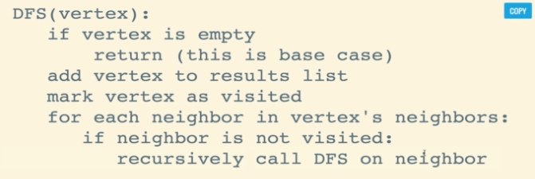
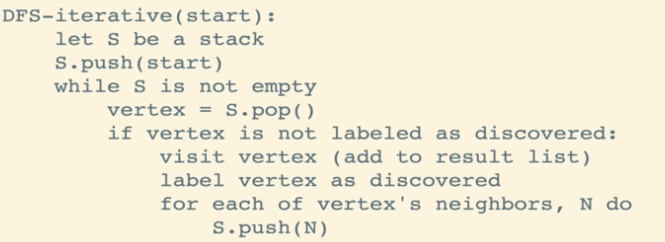
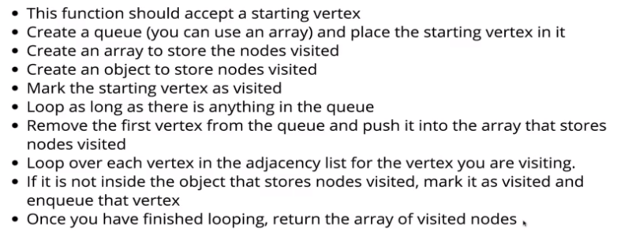

# 그래프의 순회 (Traversal)

트리(Tree)는 그래프의 일종이므로, 트리를 순회하는데 사용한 **깊이 우선 탐색(DFS, Depth-First Search)과 넓이 우선 탐색(BFS, Breadth-First Search)을 사용해 그래프를 순회**할 수 있다.

하지만 트리의 순회(Tree Traversal)와 그래프의 순회(Graph Traversal)는 **자료구조의 특성으로 인한 차이점이 존재**하며, 이러한 부분에 주의하며 순회 알고리즘을 구현해야 한다.

- **진입점(Entry Point)을 직접 지정**해 주어야 한다.
    - 그래프 순회의 시작점에 따라 순회 결과가 달라질 수 있다.
- 정점과 정점 사이에 **하나 이상의 경로가 존재**할 수 있다.
    - 백트래킹(Back Tracking)과 같은 탐색 기법을 적용할 수 있어야 한다.
- **방향성과 가중치**를 가질 수 있다.

 

## 깊이 우선 탐색

깊이 우선 탐색은 현재 노드의 **형제 노드보다 자식 노드를 먼저 탐색**해 나가는 방법이다.

그래프에서 깊이가 무엇을 뜻하는지 시각적으로 이해하기 조금 어려울 수 있지만, 트리에서 사용한 깊이 우선 탐색과 거의 동일하다.

깊이 우선 탐색은 기본적으로 스택(Stack) 자료구조를 사용해야 하는데, 재귀 함수를 호출할 때 생성되는 **콜 스택(Call Stack)을 이용하는 방법**과, 명시적으로 스택을 구현하기 위해 **배열(Array)을 이용하는 방법**이 있다.

- Recursive DFS, 콜 스택을 이용하는 방법
    - 정점의 **방문 여부를 기록**하기 위해 Javascript 객체를 사용한다.
    - 방문하지 않은 이웃 정점(= 자식 노드)이 존재하는 경우, **재귀 함수를 호출**한다.

      

- Iterative DFS, 배열을 이용하는 방법
    - Javascript 배열의 `push()`, `pop()`을 이용해 스택 자료구조를 표현한다.
    - 스택에 아무런 정점이 남아있지 않을 때까지 다음을 반복한다.
        - 스택에서 정점을 하나 꺼내고, 방문한 적 없는 정점이면 방문처리한다.
        - 방문하지 않은 이웃 정점(= 자식 노드)이 존재하는 경우, 스택에 추가한다.
        
      

 

## 넓이 우선 탐색

넓이 우선 탐색은 현재 노드의 **자식 노드보다 형제 노드를 먼저 탐색**해 나가는 방법이다.

넓이 우선 탐색은 큐(Queue) 자료구조를 사용해야 하는데, 대부분의 경우 Javascript 배열의 `unshift()`, `pop()` 메서드를 사용해 큐의 동작을 표현한다. 

> 직접 큐를 구현하여 삽입/삭제 시간 복잡도를 O(1)로 줄이면, 성능 개선이 가능하다.

 

