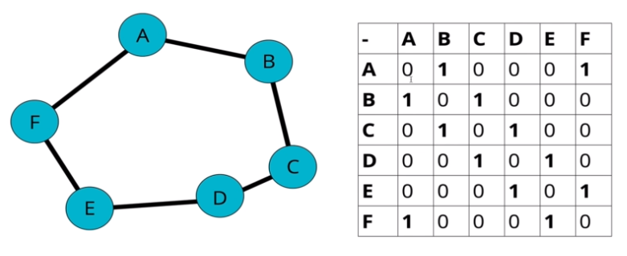

# Graph

그래프(Graph)는 유한한 개수의 정점(Vertex)과 그러한 정점을 연결하는 간선(Edge)으로 구성된 자료구조이다.

> 트리(Tree)는 그래프 자료구조의 한 종류이며, **하나의 정점에서 다른 정점으로 가는 방법이 단 하나만 존재하는 그래프**이다.

그래프 자료구조에서 사용되는 몇가지 중요한 용어는 다음과 같다.

- 정점(Vertex)
    - 그래프를 구성하는 노드(Node)를 뜻한다.
- 간선(Edge)
    - 그래프의 정점들을 연결하는 선분을 뜻한다.
- 방향/무방향(Directed/Undirected)
    - 간선이 방향성을 가지는지에 따라 **방향 그래프와 무방향 그래프로 분류**된다.
    - 방향 그래프에서는 **간선에 정해진 방향으로만 이동**할 수 있다.
        - 정점 A에서 정점 B로만 이동할 수 있으며, 반대로는 이동할 수 없다.
    - 무방향 그래프에서는 간선을 따라 **양방향으로 이동**할 수 있다.
        - 정점 A에서 정점 B로, 정점 B에서 정점 A로 이동할 수 있다.
- 가중/비가중(Weighted/Unweighted)
    - 간선에 대한 가중치 부여 여부에 따라 **가중 그래프와 비가중 그래프로 분류**된다.
    - 가중 그래프에서는 **높은 가중치를 가지는 간선을 선택해 이동**할 수 있다.
        - 대표적으로 네비게이션에서 최적 경로를 탐색하는데 사용된다.
    - 비가중 그래프에서는 **가중치가 존재하지 않아, 어떤 간선이든 선택해 이동**할 수 있다.
 
 

## 그래프를 표현하는 방법

그래프를 표현하는 방법은 굉장히 많지만, 대표적으로는 다음의 두 가지 방법을 사용한다.

- 인접 행렬(Adjacency Matrix)
    - 중첩 배열(Nested Array)를 사용해 그래프를 표현한다.

      

- 인접 리스트(Adjacency List)
    - 연결 리스트(Linked List)를 사용해 그래프를 표현한다.

      

    - 정점이 숫자형이 아닌 문자열인 경우, 해시 테이블(Hash Table)을 사용하기도 한다.

      

그래프를 표현하는 방법에 따라 **시간 복잡도와 공간 복잡도가 변화**하며, 인접 행렬을 이용하는 방법과 인접 리스트를 이용하는 방법은 각각 장점과 단점이 존재한다.

- 인접 행렬의 시간/공간 복잡도는 **정점 개수의 영향**을 받는다.
    - 정점의 개수는 많고, 간선의 수가 적은 경우 자원을 낭비할 가능성이 있다.
        - 정점의 수만큼 중첩 배열을 생성하므로, **O(V^2)의 공간 복잡도**를 가진다.
    - 모든 간선을 순회하는데 소요되는 시간 복잡도가 크다.
        - 마찬가지로 중첩 배열을 순회하므로, **O(V^2)의 시간 복잡도**를 가진다.
    - 특정 간선을 조회하는데 소요되는 시간 복잡도가 작다.
        - 배열의 인덱스를 사용하므로, **O(1)의 시간 복잡도**를 가진다.

- 인접 리스트의 시간/공간 복잡도는 **정점과 간선 개수의 영향**을 받는다.
    - 정점의 개수는 많고, 간선의 수가 적은 경우 최소한의 자원만 사용한다.
        - 간선의 수만큼 리스트를 생성하여, **O(V + E)의 공간 복잡도**를 가진다.
    - 모든 간선을 순회하는데 소요되는 시간 복잡도가 작다.
        - 마찬가지로 실존하는 간선만 순회하여, **O(V + E)의 시간 복잡도**를 가진다.
    - 특정 간선을 조회하는데 소요되는 시간 복잡도가 크다.
        - 인덱스를 이용해 직접 조회할 수 없어, **O(V + E)의 시간 복잡도**를 가진다.

> 현실 세계의 데이터는 대부분 간선의 개수보다 정점의 개수가 더 많다. 즉, 인접 행렬을 사용해 그래프를 표현하는 방법보다 **연결 리스트를 사용하는 방법을 선호**한다.
