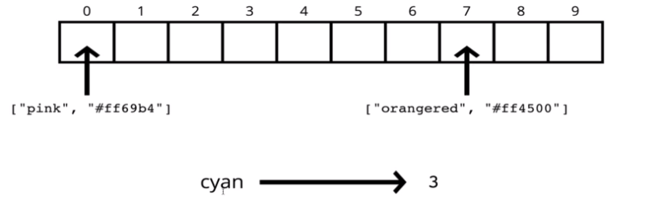
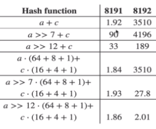
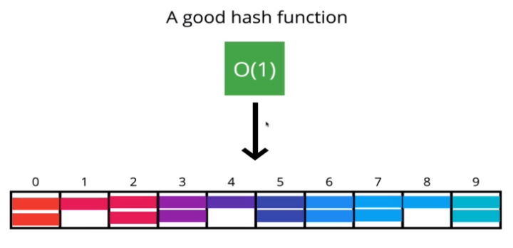
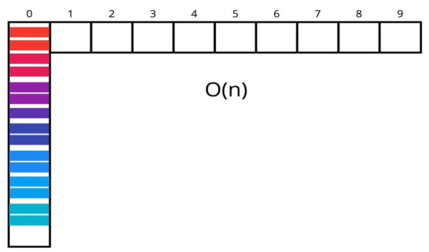

# Hash Table

해시 테이블(Hash Table) 또는 해시 맵(Hash Map)은 데이터를 *Key-Value Pair* 형태로 저장하는 자료구조이다.

해시 테이블의 특징은 다음과 같다.

- 데이터를 *Key-Value* 쌍으로 저장한다.
- *Key* 값으로 **어떠한 자료형도 사용 가능**하다.
    - 배열(Array)은 *key* 값으로 정수만 사용할 수 있다.
- 데이터의 순서를 보장하지 않는다.
- 배열에 비해 데이터의 추가, 삭제, 탐색을 빠르게 수행한다.

해시 테이블 자료구조는 대부분의 프로그래밍 언어 자체에 내장되어 있다. 

Javascript는 `Object` 자료형과 ES6에서 추가된 `Map` 자료형이 존재하는데, `Object`의 경우 일반적인 해시 테이블과 달리 ***Key* 값으로 문자열만 사용할 수 있는 제약사항**이 존재한다.

<br>

## 해시 테이블의 장점

해시 테이블의 장점은 배열에 비해 데이터의 추가, 삭제, 탐색이 빠르다는 점도 있지만, *Key* 값으로 사람이 읽을 수 있는(Human-Readable) 값을 사용할 수 있다는 것이다.

예를 들어 색상표를 저장할 때, `#000000`, `#FFFFFF`와 같은 16진수 색상 값을 해시 테이블에 저장하면 배열에 저장하는 경우에 비해 편리하게 사용할 수 있다.

```javascript
const colorArr = ["#000000", "#FFFFFF"];
const colorObj = { black: "#000000", white: "#FFFFFF" };

// 같은 값을 가져오지만, Object를 이용하면 가독성이 향상된다.
console.log(colorArr[0]);
console.log(ColorObj["black"]);
```

<br>

## 해시 테이블의 작동 원리

보통 해시 테이블을 구현하기 위해 배열을 사용하는데, 배열은 *Key* 값으로 정수만 사용할 수 있다. 

그러므로 `color["black"]`와 같이 정수가 아닌 *Key*를 사용할 때, ***Key* 값을 배열의 유효한 *Index*로 변환하는 과정이 필요**하며, 이러한 과정을 수행하는 함수를 해시 함수(Hash Function)라고 한다.



<br>

## 해시 함수

해시 함수(Hash Function)는 임의의 길이를 갖는 데이터를 **고정된 길이의 데이터로 변환**하는 함수이다. 해시 함수는 해시 테이블을 구현하기 위해 사용되지만, 암호학 등의 컴퓨터과학 분야에서도 활발하게 사용되고 있다.

대부분의 경우 해시 함수를 반대 방향으로 동작하지 않는다. 해시 함수를 호출하여 얻은 데이터는 그 자체로는 아무런 의미를 가지지 않으며, **결과 데이터를 사용해 원본 데이터의 값을 알아낼 수 없다*는 것이다. 

해시 함수는 다음의 몇가지 조건을 만족하도록 설계되어야 한다.

- 수행시간이 짧아야 하며, **O(1)의 시간 복잡도**를 가진다.
    - 해시 테이블에 접근하기 위해 매번 호출되는 함수이기 때문이다.
    - 따라서 `for`, `while`과 같은 반복문을 사용하면 안된다.
- 특정한 범위 내에서, 결과값이 **편향되지 않고 고르게 분포**해야 한다.
- **같은 입력에 대해 항상 같은 결과를 도출**해야 한다.

### 해시 함수와 소수(Prime Number)

수학적 설명은 굉장히 복잡하므로 생략하지만, 해시 함수에서 소수를 사용하면 **결과값이 고르게 분포**하게 된다. 

또한 해시 테이블에서 사용하는 배열의 길이를 소수로 설정하는 것도 도움이 된다고 한다. 
 


위의 배열의 길이가 `8191`인 경우와 `8192`인 경우를 비교한 자료에서, 배열의 길이가 소수일 때 데이터가 고르게 분포하는 현상을 확인할 수 있다.

<br>

## 해시 충돌 (Collision)

해시 충돌이란, **두 개의 다른 입력에 대해 해시 함수를 수행한 결과가 같은 경우**를 말한다. 

해시 함수는 넓은 범위의 값을 좁은 범위로 함축하는 것이기 때문에, 어떤 **해시 알고리즘을 사용하더라도 해시 충돌은 불가피**하며, 다만 충돌이 발생할 확률이 줄어드는 것 뿐이다. 

해시 충돌이 발생한 상황을 해결하기 위한 대표적인 두 가지 방법은 다음과 같다.

- 체이닝 (Separate Chaining)
    - 해시 테이블의 각 인덱스에서 **중첩된 자료구조를 사용**해 데이터를 저장한다.
        - 즉, 하나의 위치에 다수의 데이터를 저장하는 것이 가능하다.
    - 충돌 발생 시, 연결 리스트와 같은 자료구조를 이용해 데이터를 연결해 나간다.
    - **탐색에 소요되는 시간이 길어지는 단점**도 존재한다.    

- 선형 탐색법 (Linear Probing)
    - 각 인덱스에 단 하나의 데이터만을 저장할 수 있도록 한다.
    - 충돌 발생 시, 배열을 순회하며 비어있는 공간을 찾고, 해당 위치에 값을 저장한다.
    - 더 이상 공간이 없는 경우, 기존의 값을 삭제하거나 체이닝 기법을 혼용할 수 있다.

<br>

## 해시 테이블의 시간 복잡도

해시 테이블은 평균적으로 데이터의 추가, 삭제, 접근에 대해 **O(1)의 상수 시간 복잡도**를 가지는 굉장히 효율적인 자료구조이다.

해시 테이블의 시간 복잡도는 해시 함수의 성능에 따라 좌우되며, 따라서 **시간 복잡도 O(1)을 가지는 동시에 충돌 확률을 최소화하는 해시 함수**를 구현하는 것이 중요하다.



해시 함수의 시간 복잡도도 중요하지만, 결과값이 고르게 분포하도록 하는 것도 좋은 해시 함수를 만들기 위해 반드시 고려해야 하는 사항이다. 

해시 함수의 수행 복잡도가 O(1)이라 하더라도, 해시 함수 수행 결과가 해시 테이블의 일부분에 편중되면 최악의 경우 아래와 같은 연결 리스트의 형태가 되며, **해시 테이블의 사간 복잡도는 O(N)까지 증가**하게 되기 때문이다.



<br>

## 결론

일반인이 성능 좋은 해시 함수를 만드는 것은 사실상 불가능하며, 전문적인 수학 지식이 요구되는 영역이다.

따라서 프로그래밍 언어에서 기본으로 제공하는 `Object`, `Map` 등의 자료구조를 이용하거나, 오픈소스로 제공되는 라이브러리를 사용하는 것이 좋다.