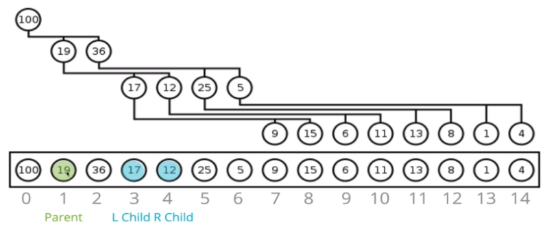

# Heap

힙(Heap)은 트리(Tree)의 한 종류로, **트리에 적용되는 모든 특성과 규칙 공유**한다. 물론, 트리와 힙을 구분하게 하는 특별한 특성도 가지고 있다.

힙에도 다양한 변형이 존재하지만 강의에서는 **이진 힙(Binary Heap)만을 다루며, 이진 힙은 다시 최소 힙과 최대 힙으로 구분**된다.

힙은 이진 탐색 트리(Binary Search Tree, BST)와 유사하지만, 몇가지 차이점이 존재한다.

- 이진 탐색 트리 (Binary Search Tree)
    - 부모 노드는 최대 두 개의 자식 노드만 가질 수 있다.
    - 부모 노드의 값보다 **작은 값을 가지는 노드는 왼쪽 서브트리**에 위치시킨다.
    - 부모 노드의 값보다 **큰 값을 가지는 노드는 오른쪽 서브트리**에 위치시킨다.

- 이진 힙 (Binary Heap)
    - 부모 노드는 최대 두 개의 자식 노드만 가질 수 있다.
    - 형제 노드 사이에서의 대/소 관계는 보장되지 않는다.
    - 항상 최소한의 공간을 사용하는 **완전 이진 트리(Complete Binary Tree)** 형태이다.
        - 현재 레벨이 모두 노드로 채워지지 않으면, 다음 깊이로 진행할 수 없다.
        - 새로운 노드를 추가할 때, 항상 왼쪽부터 시작한다.
    - 최소 이진 힙 (Min Binary Heap)
        - 부모 노드는 **반드시 자식 노드보다 작은 값**을 갖는다.
    - 최대 이진 힙 (Max Binary Heap)
        - 부모 노드는 **반드시 자식 노드보다 큰 값**을 갖는다.

<br>

## 힙을 표현하는 방법

힙은 트리의 새로운 노드를 추가할 때 현재 노드의 **왼쪽부터 자식 노드를 추가**하며, 현재 레벨에 더 이상 **자식 노드를 추가할 자리가 없을 때 깊이를 확장**한다. 

이와 같이 힙은 **완전 이진 트리의 특성**을 가지며, 따라서 배열(Array)의 형태로 표현될 수 있다.

> 다시 말해, 새로운 노드를 힙의 가장 왼쪽부터 추가하는 동작을 **배열의 가장 맨 뒤에 요소를 추가하는 것으로 표현**하는 것이다.



- 부모 노드가 배열의 인덱스 `n` 위치에 저장되어 있을 때,
    - 왼쪽 자식 노드는 **항상 인덱스 `2n + 1`에 위치**한다.
    - 오른쪽 자식 노드는 **항상 인덱스 `2n + 2`에 위치**한다.

- 반대로 자식 노드가 배열의 인덱스 `n` 위치에 저장되어 있을 때,
    - 부모 노드는 **항상 인덱스 `(n - 1) / 2` 에 위치**한다.
        - 정확히는 `Math.floor((n - 1) / 2)`이다.

<br>

## 힙에 새로운 요소를 추가

힙에 새로운 요소를 삽입(Insertion)하는 의사 코드(Pseudo Code)는 다음과 같다.

```javascript
class MaxBinaryHeap {
    constructor() {
        this.values = [];
    }
}
```

1. 힙의 `values ` 속성에 새로운 요소를 추가한다.
2. 새로운 요소의 알맞은 위치를 찾을 때 까지 *Bubble Up*을 수행한다.
    - 현재 위치를 저장할 변수 `idx`를 선언하고, `length - 1`로 초기화한다.
    - 부모의 위치를 저장할 변수 `parentIdx`를 선언하고, `(idx -1) / 2`로 계산한다.
    - `parentIdx` 위치의 값이 `idx` 위치의 값보다 작다면,
        - 두 값의 위치를 맞바꾼다.
        - `idx`의 값을 `parentIdx`로 변경하고, 다시 시작한다.
