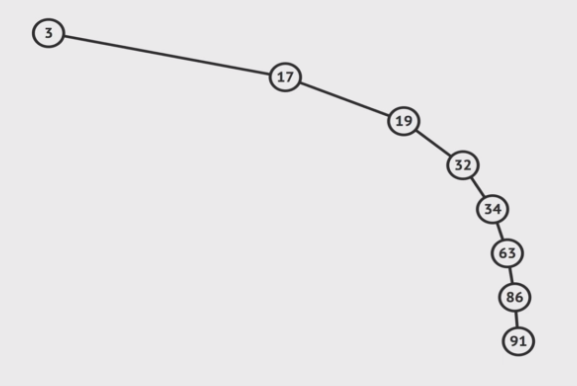

# Tree

트리(Tree)는 **부모/자식의 관계에 있는 노드(Node)로 이루어진 자료구조**이다. 부모 노드는 한 개 이상의 자식 노드를 가질 수 있으며, 이들에 대한 참조를 보관한다.

배열과 리스트는 선형(Linear) 자료구조라고 하며, 트리는 비선형(Non-Linear) 자료구조라고 한다. 단 하나의 순회 방법을 가지는 선형 자료구조에 비해, **비선형 자료구조는 데이터를 순회하는 방법이 한 개 이상 존재**한다. 

> 단방향 연결 리스트는 트리의 특별한 형태로 생각할 수도 있다.

 

## 트리의 조건

- 트리는 **단 하나의 루트(Root) 노드**, 즉 부모 노드가 없는 노드를 가진다.

- 트리의 루트 노드를 포함한 모든 부모 노드는 0개 이상의 자식 노드를 가진다.
    - 동일한 레벨(Level)에 존재하는 노드는 부모/자식 관계를 가질 수 없다.

- 트리의 서로 다른 임의의 두 노드에 대해, **두 노드를 연결하는 경로는 유일**하다.
    - 즉, 두 개의 부모 노드가 하나의 자식 노드를 공유할 수 없다.

- 트리에는 사이클이 존재할 수 없다.
    - 사이클이란, 무한히 순환할 수 있는 경로를 말한다.

 

## 트리와 관련된 용어

- 노드(Node)
    - 루트 노드: 부모가 없는 노드로, 트리의 진입점(Entry Point)이다.
    - 리프 노드: 자식이 없는 노드로, 트리의 종료점이다. 단말 노드라고도 부른다. 
    - 내부 노드: 트리의 내부에 존재하며, 단말 노드가 아닌 노드.
    - 부모 노드: 루트 노드 방향으로 직접 연결된 노드.
    - 자식 노드: 루트 노드 반대방향으로 직접 연결된 노드.

- 형제(Sibling)
    - 같은 부모 노드를 가지는 노드를 형제 관계에 있다고 한다.
    - 단순히 같은 레벨(Level)에 있다고 형제 관계가 수립하는 것은 아니다.

- 간선(Edge): 노드 사이의 연결.

- 크기(Size): 트리를 구성하는 모든 노드의 개수.

- 깊이(Depth): 루트 노드에서 특정 노드에 도달하기 위해 거쳐야 하는 간선의 개수.

- 높이(Height): 루트 노드에서 가장 멀리 떨어져 있는 노드의 깊이. 

- 레벨(Level): 트리의 특정 높이에 존재하는 모든 노드의 집합.

- 차수(Degree): 특정 노드가 가지는 자식의 개수.

 

## 트리의 종류

트리의 종류는 굉장히 다양하지만, 강의에서는 다음의 세가지 트리만을 다룬다.

- 트리 
- 이진 트리 (Binary Tree)
    - 각 노드는 **최대 두 개의 자식 노드**만 가질 수 있다.
- 이진 검색 트리 (Binary Search Tree, BST)
    - 각 노드의 **왼쪽에는 노드의 값보다 작은 값**만 존재한다.
    - 각 노드의 **오른쪽에는 노드의 값보다 큰 값**만 존재한다.
    - 트리에서 특정한 값을 탐색할 때, O(logN)의 시간 복잡도로 수행한다.
        - 이진 탐색(Binary Search)을 수행하는 것과 같다.

 

## 이진 검색 트리의 한계점

`[1, 2, 3, 4, 5, 6]`과 같이 이미 정렬된 데이터가 트리에 순차적으로 삽입되는 경우, 아래 그림과 같이 오른쪽으로 **편중된 이진 검색 트리가 형성**되게 된다.

이러한 경우, 이진 검색 트리에서 **데이터 삽입/탐색에 걸리는 시간은 기존 O(logN)에서 O(N)까지 증가**하게 된다. 즉, 단방향 연결 리스트에서의 삽입/탐색과 동일한 시간 복잡도를 가지게 되는 것이다.

정렬된 데이터를 이용해 이진 검색 트리를 구성할 때 트리가 한쪽 방향으로 편향되는 문제를 해결하려면, 트리에 **데이터를 삽입하는 순서를 변경**하면 된다. 